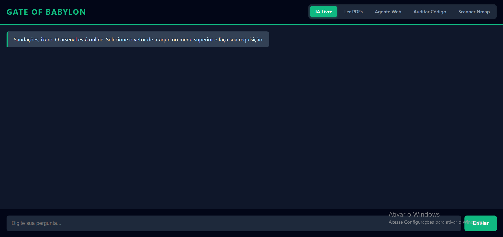
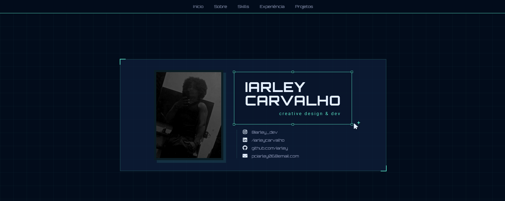

  

<h1 align="center">Olá, eu sou Iarley Carvalho Araujo! 👋</h1>

  <b>Red team | Cyber Security Enthusiast | Software Developer</b>

  Estudante de Defesa cibernetica (impacta) e Técnico em Desenvolvimento de Sistemas pela ETEC. 
  Minha trajetória é movida pela curiosidade técnica e pelo desejo de proteger ambientes digitais. Atualmente, foco na intersecção entre <b>desenvolvimento full-stack</b> e <b>segurança da informação</b>.

  
  
  

---

<table>
  <tr>
    <td width="60%">
      <h3>💫 Sobre mim</h3>
      <ul>
        <li>🔭 <b>Em desenvolvimento:</b> PFCI Saúde e Aximoz Wallet.</li>
        <li>🔐 <b>Cyber Focus:</b> Pentesting, Kali Linux e Defesa Cibernética.</li>
        <li>💻 <b>Stack principal:</b> PHP, JavaScript, Python, Java, C# e Dart.</li>
        <li>⚡ <b>Objetivo:</b> Transição para carreira em Cyber Security.</li>
      </ul>
    </td>
    <td width="40%" align="center">
      
    </td>
  </tr>
</table>

<h3 align="center">📊 Nível de Habilidades</h3>

    
    
    
    
    
    
   

---

<h3 align="center">🚀 Repositórios em Destaque</h3>

  
  
  

---

<h3 align="center">🛠️ Tecnologias e Ferramentas</h3>

  

---

<h3 align="center">📫 Vamos conversar?</h3>

  
  

  

